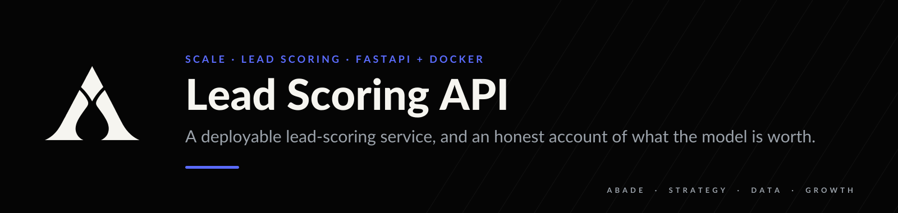
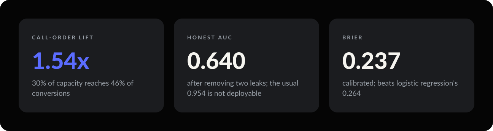
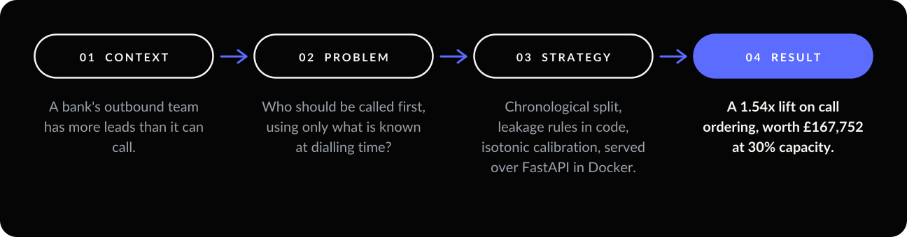
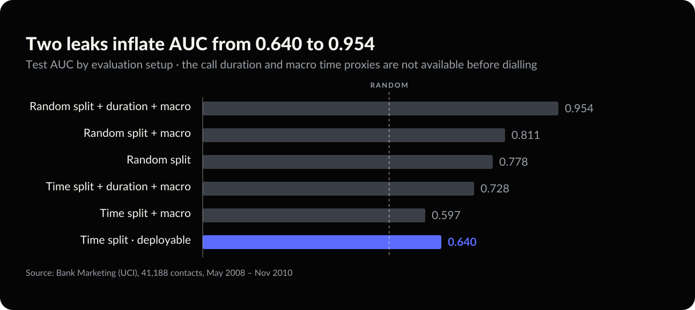

<p align="center"></p>

<p align="center">
  
  
  
  
</p>

**This dataset is usually reported at 0.954 AUC. A model that scores leads before dialling gets
0.640.** What survives the two leaks is a 1.54x lift on call ordering: 30% of call capacity reaches
46% of conversions.

<p align="center"></p>

<p align="center"></p>

---

## 01 — Context

A bank's outbound team has more leads than it can call. Each call costs money, and each subscription
is worth more than the call.

### Data

| | |
| --- | --- |
| Source | Bank Marketing, UCI Machine Learning Repository ([link](https://archive.ics.uci.edu/dataset/222/bank+marketing)) |
| Content | Portuguese bank, outbound term-deposit campaigns, May 2008 – Nov 2010 |
| Size | 41,188 contacts · 20 original features |
| Split | 26,360 train · 6,590 validation · 8,238 test, **in file order** |

**All data is real.** The call economics (£8 per call, £160 per conversion) are declared in
`config.py`.

**The shift that governs everything:** conversion runs **4.8% in training and 30.8% in test**. The
campaign ran through the financial crisis, and term deposits became far easier to sell. Four months
appear only after the training cutoff. The service maps them to a missing category instead of
failing, and a test covers it.

> The brief originally named Olist's marketing-funnel dataset. It needs Kaggle credentials and has no
> public mirror. Bank Marketing is a real funnel with a conversion outcome that clones and runs
> without a login.

---

## 02 — Problem

Not *who will convert*, but *who should be called first, using only what is known at dialling time*.

---

## 03 — Strategy

| Decision | Why |
| --- | --- |
| **Drop `duration`** | It is the length of the call, so it exists only after the call. It is the largest driver of inflated results on this dataset. |
| **Drop macro columns** | `euribor3m` runs 4.08–5.05 in training and 0.63–1.30 in test, with zero overlap. It is a date in disguise, and it is constant across the leads being ranked on any given day. |
| **Chronological split** | A random split lets the model see the future state of the economy. |
| **Isotonic calibration on validation** | Scores drive a money calculation, so they must behave like probabilities. |
| **Keep the logistic baseline** | A model that cannot clearly beat it should say so before carrying an API, a container and CI. |
| **Break-even gate, not 0.5** | Call when `p × value ≥ cost`. |
| **MLflow on SQLite** | The smallest backend that still supports the model registry. |

```
break_even_probability = cost_per_call / value_per_conversion = 8 / 160 = 0.05
expected_value(call)   = p * value_per_conversion - cost_per_call
lift_vs_random_order   = share_of_conversions_captured / share_of_list_called
```

---

## 04 — Result

<p align="center"></p>

Dropping the macro columns **raises** chronological AUC (0.597 → 0.640) and **lowers** random-split
AUC (0.811 → 0.778). A feature that helps under a random split and hurts under a time split is a time
proxy, not a signal.

| Deployable model | AUC | PR-AUC | Brier |
| --- | --- | --- | --- |
| LightGBM, calibrated | 0.658 | 0.425 | **0.237** |
| LightGBM, raw | **0.661** | 0.438 | 0.280 |
| Logistic regression | 0.643 | **0.443** | 0.264 |
| Prior (base rate) | 0.500 | 0.308 | 0.281 |

Boosting barely beats logistic regression on ranking. It earns its place on **calibration**.

Break-even is a 5% conversion probability, and the test base rate is 30.8%, so every lead clears it.
The model does not decide *who to skip*. It decides *who goes first*:

| Capacity | Conversions captured | Lift vs random order | Net value |
| --- | --- | --- | --- |
| Top 10% | 15.9% | **1.59x** | £58,056 |
| Top 20% | 31.3% | 1.57x | £114,184 |
| Top 30% | 46.1% | 1.54x | £167,752 |
| Top 50% | 66.5% | 1.33x | £237,128 |

> **Decision.** Work the list in score order. A team with capacity for 30% of the list reaches 46% of
> conversions, a long way from what a 0.954 AUC would promise.

---

## 05 — Limits and next move

- **AUC 0.640 is a weak model, and that is the finding.** The honest framing is a 1.5x lift on
  ordering, not a predictive breakthrough.
- **The test period is not the deployment period.** Early stopping at iteration 7 is a symptom: deeper
  fits do not transfer across the shift.
- **Call economics are assumed.** At £20 per call, break-even rises to 12.5% and the model starts
  excluding leads.
- **No uplift modelling.** Some high scorers would subscribe anyway. See
  [ab-testing-toolkit](https://github.com/arielabade/ab-testing-toolkit).
- **Next move:** rolling-window retraining with time-based validation, and a drift monitor on the live
  score distribution.

---

## Run it

```bash
git clone https://github.com/arielabade/lead-scoring-api
cd lead-scoring-api
python -m venv .venv && source .venv/bin/activate
pip install -e ".[dev]"

python -m lead_scoring.train        # downloads data, trains, logs to MLflow, writes models/
pytest                              # 18 tests
uvicorn app.main:app --reload       # http://localhost:8000/docs
```

**Container**

```bash
docker build -t lead-scoring-api .
docker run -p 8000:8000 lead-scoring-api
curl localhost:8000/health
```

**Score a lead**

```bash
curl -X POST localhost:8000/score \
  -H 'content-type: application/json' \
  -d '{"age":30,"job":"student","marital":"single","education":"university.degree",
       "default":"no","housing":"no","loan":"no","contact":"cellular","month":"mar",
       "day_of_week":"thu","campaign":1,"pdays":3,"previous":2,"poutcome":"success"}'
# {"probability":0.236,"call":true,"priority":"high"}
```

`duration` is not in the schema. It cannot be supplied, because at scoring time it does not exist.

**CI.** A workflow that trains, tests, builds the image, starts the container and scores a lead
through it is written and verified locally but not yet committed. Pushing `.github/workflows/` needs
the `workflow` token scope: `gh auth refresh -h github.com -s workflow`.

## Repository map

```
src/lead_scoring/   config (assumptions + leakage rules), data, features, train, evaluate, schema
app/                FastAPI service
tests/              leakage rules, evaluation maths, API contract
reports/            metrics, deciles, capacity value, expected-value curve
notebooks/          leakage exploration
```

---

<p align="center"></p>

<p align="center">
  <a href="https://github.com/arielabade">Portfolio</a> &nbsp;·&nbsp;
  <a href="https://github.com/arielabade/ab-testing-toolkit">Measure what the call actually caused →</a>
</p>
